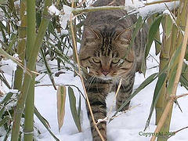

# 花名

阿里集团喜欢使用花名来以示平等与减少不必要的问题。

喵喵团队开发规范也从平等开始，以统一团队形象为目的，推荐使用猫名来作为提交 commit 的 author 签名。

当然，不仅仅是喵喵，狗勾、宝可梦也是非常 ok 的选择

- [喵喵品名](https://en.wikipedia.org/wiki/List_of_cat_breeds)
- [宝可梦名单](https://github.com/sindresorhus/pokemon/blob/main/data/en.json)
